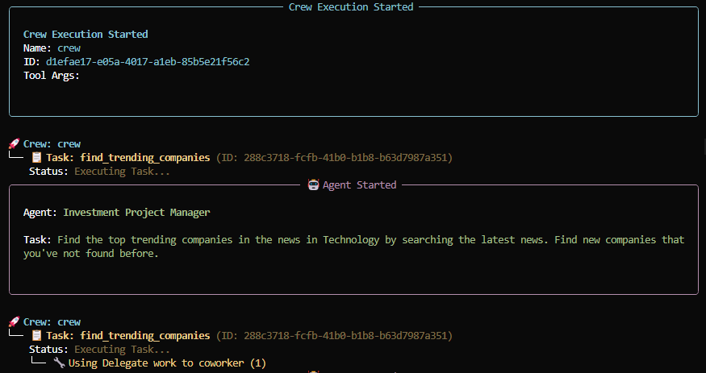
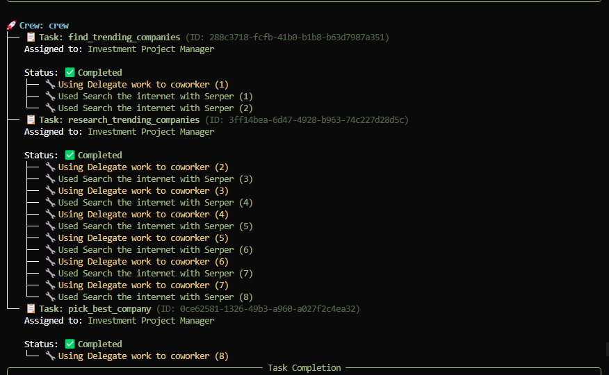
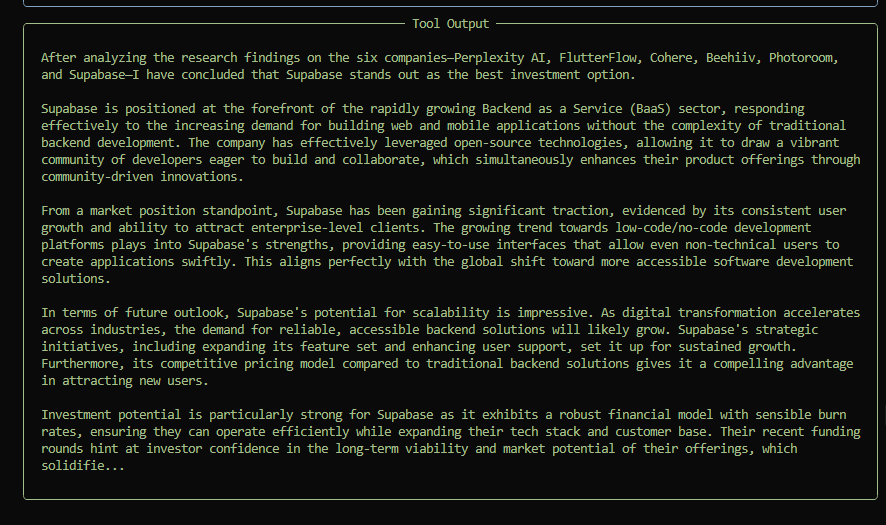
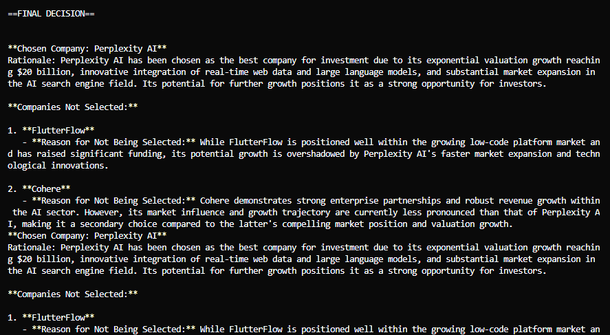
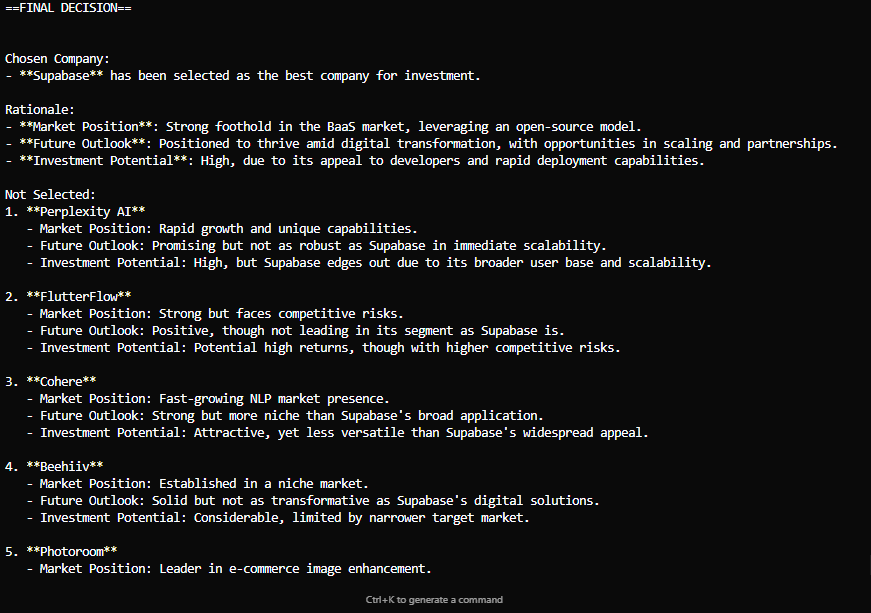

# 📈 Stock Picker AI Crew

This project demonstrates an **AI agent framework for financial analysis** using [CrewAI](https://crewai.com).  
Instead of a simple sequential workflow, we designed a **hierarchical crew** with a manager agent that oversees specialized agents.  
The system identifies trending companies, conducts thorough research on them, and selects the most promising investment opportunity.

---

## 🚀 Features
- **Hierarchical Process**: A manager agent assigns tasks to sub-agents instead of just sequential execution.
- **Multiple Specialized Agents**:
  - `trending_company_finder` → scans financial news for trending companies.
  - `financial_researcher` → produces detailed research reports.
  - `stock_picker` → picks the best company for investment.
  - `manager` → coordinates the overall workflow.
- **Structured Outputs**: Used Pydantic models (`TrendingCompanyList`, `TrendingCompanyResearchList`) to enforce reliable structured data.
- **Custom Tools**:
  - `SerperDevTool` for financial news search.
  - `PushNotificationTool` for real-time user updates.
- **Config Driven**: Agents and tasks defined in YAML (`agents.yaml`, `tasks.yaml`) for easy reconfiguration.
- **Extensible**: Supports passing an LLM by model name or delegating to an agent that manages sub-tasks.

---

## 🛠️ Technologies Used
- [CrewAI](https://crewai.com) – agent orchestration
- [SerperDevTool](https://serper.dev/) – news search
- [Pydantic](https://docs.pydantic.dev/) – structured output validation
- [Requests](https://requests.readthedocs.io/) – API calls
- **Push Notification Tool** – custom integration with [Pushover](https://pushover.net/)

---
## 🔹 Crew Execution Overview

### 1. Task Assignment
The manager agent assigns tasks like `find_trending_companies` and delegates work to coworkers.

---

### 2. Crew Execution Started
The system initializes, and the **Investment Project Manager** agent begins executing the first task.

---

### 3. Delegations and Searches
Agents use the SerperDev tool to search the internet and return structured results, with multiple delegation steps shown.

---

### 4. Research Output
The research agent compiles findings into a detailed, structured analysis of multiple companies.

---

### 5. First Final Decision Example
The crew selects **Perplexity AI** as the best company, citing specific reasons.  
Other companies like FlutterFlow and Cohere are marked as “Not Selected” with a rationale.

---

### 6. Alternative Final Decision Example
In another run, the system selects **Supabase** as the strongest investment option, with clear reasoning and comparisons.

